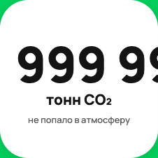

|                     |                                                                                                                                                                                                                                                                                                                                                                                                                                                                                             |
|---------------------|---------------------------------------------------------------------------------------------------------------------------------------------------------------------------------------------------------------------------------------------------------------------------------------------------------------------------------------------------------------------------------------------------------------------------------------------------------------------------------------------|
|                     |                                                                                                                                                                                                                                                                                                                                                                                                                                                                                             |
| ID:                 | **1**                                                                                                                                                                                                                                                                                                                                                                                                                                                                                       |
| Summary:            | **Отрицательные значения на счётчиках эковклада при получении отрицательных значений в ответе сервера.**                                                                                                                                                                                                                                                                                                                                                                                    |
| Expected result:    | При получении отрицательных значений на вход все счетчики показывают нулевые значения или сообщения об ошибке: Счетчик CO2 отображает значение 0 кг СО2 Счетчик воды отображает значение 0 л воды Счетчик энергии отображает значение 0 кВт*ч.                                                                                                                                                                                                                                              |
| Actual result:      | При получении отрицательных значений на вход все счетчики показывают отрицательные значения: Счетчик CO2 отображает значение -1 кг СО2 Счетчик воды отображает значение -1 л воды Счетчик энергии отображает значение -1 кВт*ч.                                                                                                                                                                                                                                                             |
| Severity:           | S4 Незначительная (Minor)                                                                                                                                                                                                                                                                                                                                                                                                                                                                   |
| Priority:           | P3 Низкий (Low)                                                                                                                                                                                                                                                                                                                                                                                                                                                                             |
| Status:             | Новый                                                                                                                                                                                                                                                                                                                                                                                                                                                                                       |
| Author:             | Красова Е.М.                                                                                                                                                                                                                                                                                                                                                                                                                                                                                |
| Reproducibility:    | Всегда                                                                                                                                                                                                                                                                                                                                                                                                                                                                                      |
| Steps to reproduce: | 1)Заменить JSON ответ от сервера на JSON с тестовыми данными: page.route(mock_url,  lambda route: route.fulfill([json file]))   2)Открыть страницу со счетчиками: page.goto(main_url)   3)Сделать скриншот счетчиков:   page.locator(co2_counter).screenshot(path=‘./screenshots/[screenshot name]’)   page.locator(water_counter).screenshot(path='./screenshots/[screenshot name]')   page.locator(energy_counter).screenshot(path='./screenshots/[screenshot name]') |
| Attachments:        |                                                                                                                                                                                                                                                                                                                                               |
|                     |                                                                                                                                                                                                                                                                                                                                                                                                                                                                                             |
| ID:                 | **2**                                                                                                                                                                                                                                                                                                                                                                                                                                                                                       |
| Summary:            | **На счетчике эковклада энергии происходит наложение элементов друг на друга при получении единиц измерения свыше 1 млн кВт*ч.**                                                                                                                                                                                                                                                                                                                                                            |
| Expected result:    | Все элементы счетчика располагаются без наложений при любых единицах измерений.                                                                                                                                                                                                                                                                                                                                                                                                             |
| Actual result:      | При получении единиц измерения свыше 1 млн кВт*ч на счетчике энергии происходит наложение элементов (class=«desktop-label-EIkG9" и class=«desktop-unit-puWVS") друг на друга.                                                                                                                                                                                                                                                                                                               |
| Severity:           | S4 Незначительная (Minor)                                                                                                                                                                                                                                                                                                                                                                                                                                                                   |
| Priority:           | P2 Средний (Medium)                                                                                                                                                                                                                                                                                                                                                                                                                                                                         |
| Status:             | Новый                                                                                                                                                                                                                                                                                                                                                                                                                                                                                       |
| Author:             | Красова Е.М.                                                                                                                                                                                                                                                                                                                                                                                                                                                                                |
| Reproducibility:    | Всегда                                                                                                                                                                                                                                                                                                                                                                                                                                                                                      |
| Steps to reproduce: | 1)Заменить JSON ответ от сервера на JSON с тестовыми данными: page.route(mock_url,  lambda route: route.fulfill([json file]))   2)Открыть страницу со счетчиками: page.goto(main_url)   3)Сделать скриншот счетчиков:   page.locator(co2_counter).screenshot(path=‘./screenshots/[screenshot name]’)   page.locator(water_counter).screenshot(path='./screenshots/[screenshot name]')   page.locator(energy_counter).screenshot(path='./screenshots/[screenshot name]') |
| Attachments:        |                                                                                                                                                                                                                                                                                                                                     |
|                     |                                                                                                                                                                                                                                                                                                                                                                                                                                                                                             |
| ID:                 | **3**                                                                                                                                                                                                                                                                                                                                                                                                                                                                                       |
| Summary:            | **Некорректное округление значений счётчиков эковклада при получении значения 999999000000000 от сервера.**                                                                                                                                                                                                                                                                                                                                                                                 |
| Expected result:    | При получении 999999000000000 на вход все счетчики округляют значения: Счетчик CO2 отображает значение 999,9 млрд тонн СО2 Счетчик воды отображает значение 999,9 млрд м3 воды Счетчик энергии отображает значение 999,9 млрд мВт*ч энергии.                                                                                                                                                                                                                                                |
| Actual result:      | Все счетчики некорректно округляют значения: Счетчик CO2 отображает значение 1000 млрд тонн СО2 Счетчик воды отображает значение 1000 млрд м3 воды Счетчик энергии отображает значение 1000 млрд мВт*ч энергии.                                                                                                                                                                                                                                                                             |
| Severity:           | S4 Незначительная (Minor)                                                                                                                                                                                                                                                                                                                                                                                                                                                                   |
| Priority:           | P3 Низкий (Low)                                                                                                                                                                                                                                                                                                                                                                                                                                                                             |
| Status:             | Новый                                                                                                                                                                                                                                                                                                                                                                                                                                                                                       |
| Author:             | Красова Е.М.                                                                                                                                                                                                                                                                                                                                                                                                                                                                                |
| Reproducibility:    | Всегда                                                                                                                                                                                                                                                                                                                                                                                                                                                                                      |
| Steps to reproduce: | 1)Заменить JSON ответ от сервера на JSON с тестовыми данными: page.route(mock_url,  lambda route: route.fulfill([json file]))   2)Открыть страницу со счетчиками: page.goto(main_url)   3)Сделать скриншот счетчиков:   page.locator(co2_counter).screenshot(path=‘./screenshots/[screenshot name]’)   page.locator(water_counter).screenshot(path='./screenshots/[screenshot name]')   page.locator(energy_counter).screenshot(path='./screenshots/[screenshot name]') |
| Attachments:        |                                                                                                                                                                                                                                                                                                                                            |
|                     |                                                                                                                                                                                                                                                                                                                                                                                                                                                                                             |
| ID:                 | **4**                                                                                                                                                                                                                                                                                                                                                                                                                                                                                       |
| Summary:            | **Некорректные значения счетчиков эковклада при получении значения 1000000000000000 в ответе сервера.**                                                                                                                                                                                                                                                                                                                                                                                     |
| Expected result:    | Все счетчики отображают корректные значения:Счетчик CO2 отображает значение 1 трлн тонн СО2 Счетчик воды отображает значение 1 трлн м3 воды Счетчик энергии отображает значение 1 трлн мВт*ч энергии                                                                                                                                                                                                                                                                                        |
| Actual result:      | Все счетчики отображают некорректные значения: Счетчик CO2 отображает значение 1 СО2 Счетчик воды отображает значение 1 воды Счетчик энергии отображает значение 1 энергии.                                                                                                                                                                                                                                                                                                                 |
| Severity:           | S4 Незначительная (Minor)                                                                                                                                                                                                                                                                                                                                                                                                                                                                   |
| Priority:           | P3 Низкий (Low)                                                                                                                                                                                                                                                                                                                                                                                                                                                                             |
| Status:             | Новый                                                                                                                                                                                                                                                                                                                                                                                                                                                                                       |
| Author:             | Красова Е.М.                                                                                                                                                                                                                                                                                                                                                                                                                                                                                |
| Reproducibility:    | Всегда                                                                                                                                                                                                                                                                                                                                                                                                                                                                                      |
| Steps to reproduce: | 1)Заменить JSON ответ от сервера на JSON с тестовыми данными: page.route(mock_url,  lambda route: route.fulfill([json file]))   2)Открыть страницу со счетчиками: page.goto(main_url)   3)Сделать скриншот счетчиков:   page.locator(co2_counter).screenshot(path=‘./screenshots/[screenshot name]’)   page.locator(water_counter).screenshot(path='./screenshots/[screenshot name]')   page.locator(energy_counter).screenshot(path='./screenshots/[screenshot name]') |
| Attachments:        |                                                                                                                                                                                                                                                                                                                                            |
|                     |                                                                                                                                                                                                                                                                                                                                                                                                                                                                                             |
| ID:                 | **5**                                                                                                                                                                                                                                                                                                                                                                                                                                                                                       |
| Summary:            | **Выход значений счетчиков эковклада за пределы контейнеров при получении значения 999999999999999999999999 в ответе от сервера.**                                                                                                                                                                                                                                                                                                                                                          |
| Expected result:    | Счётчики отображают сообщения об ошибке.                                                                                                                                                                                                                                                                                                                                                                                                                                                    |
| Actual result:      | Значения всех счетчиков выходят за пределы их контейнеров.                                                                                                                                                                                                                                                                                                                                                                                                                                  |
| Severity:           | S4 Незначительная (Minor)                                                                                                                                                                                                                                                                                                                                                                                                                                                                   |
| Priority:           | P3 Низкий (Low)                                                                                                                                                                                                                                                                                                                                                                                                                                                                             |
| Status:             | Новый                                                                                                                                                                                                                                                                                                                                                                                                                                                                                       |
| Author:             | Красова Е.М.                                                                                                                                                                                                                                                                                                                                                                                                                                                                                |
| Reproducibility:    | Всегда                                                                                                                                                                                                                                                                                                                                                                                                                                                                                      |
| Steps to reproduce: | 1)Заменить JSON ответ от сервера на JSON с тестовыми данными: page.route(mock_url,  lambda route: route.fulfill([json file]))   2)Открыть страницу со счетчиками: page.goto(main_url)   3)Сделать скриншот счетчиков:   page.locator(co2_counter).screenshot(path=‘./screenshots/[screenshot name]’)   page.locator(water_counter).screenshot(path='./screenshots/[screenshot name]')   page.locator(energy_counter).screenshot(path='./screenshots/[screenshot name]') |
| Attachments:        |                                                                                                                                                                                                                                                                                                                                            |
