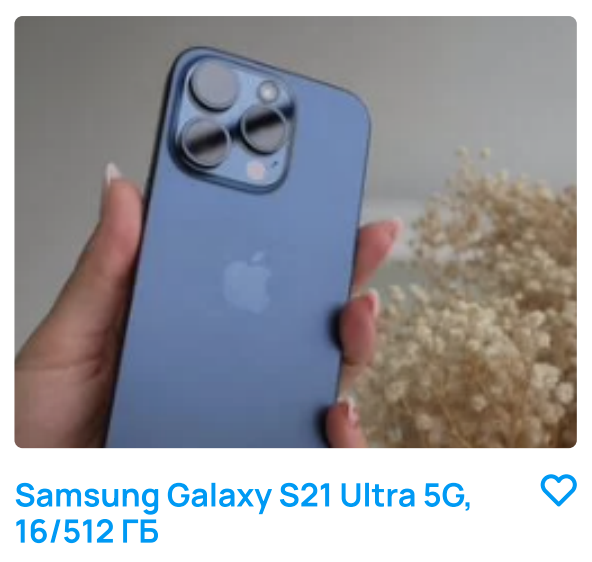
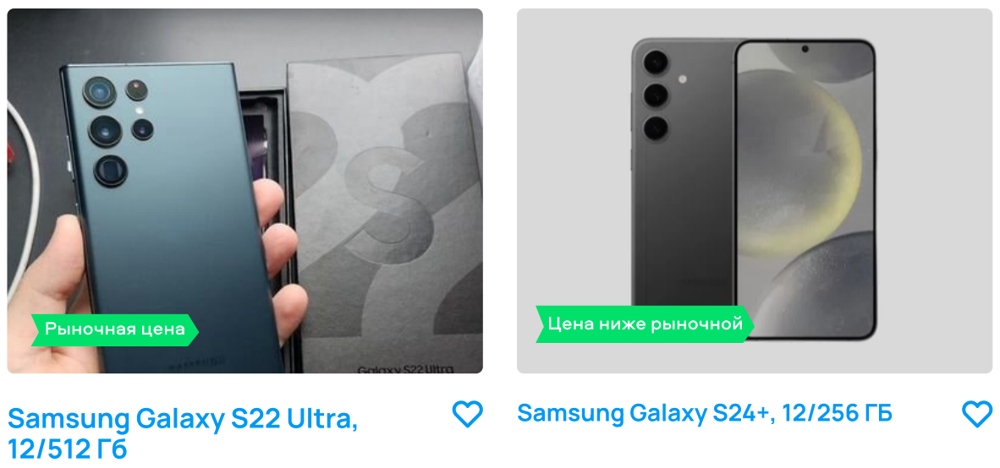
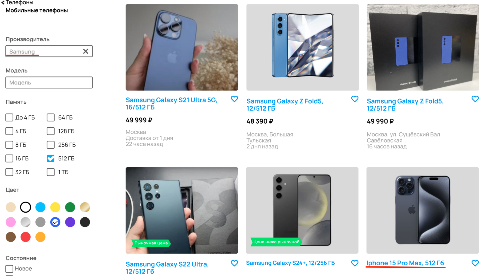
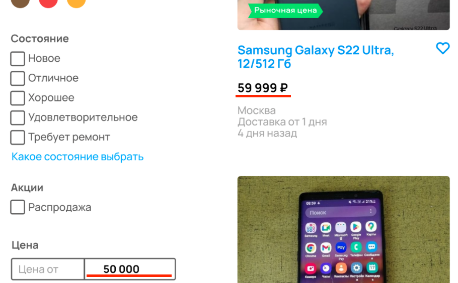
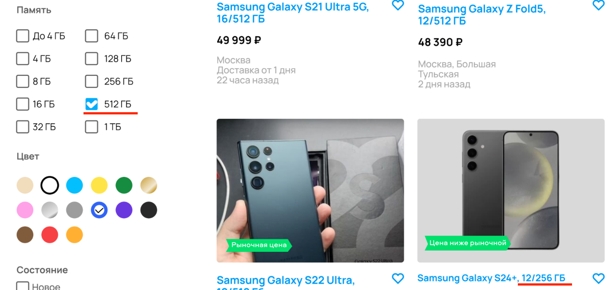
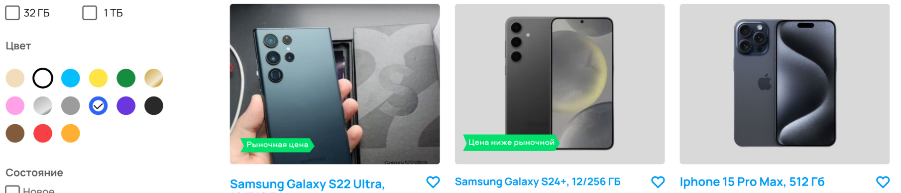

## Задание №1
### Если фильтр был выставлен, но кнопка «Показать результаты» не была нажата.
| ID  |                                          Summary                                          | Priority |                            Expected result                            |                        Actual result                         |                                                                   Attachments                                                                   |
|:---:|:-----------------------------------------------------------------------------------------:|:--------:|:---------------------------------------------------------------------:|:------------------------------------------------------------:|:-----------------------------------------------------------------------------------------------------------------------------------------------:|
| B1  |                                 Логотип написан с ошибкой                                 |   High   |                                 Avito                                 |                            Awito                             |    Expected  Actual     |
| B2  |                     Отсутствует тогл для функции «Сначала из Москвы»                      |   High   |                   Тогл для включения функции справа                   |                       Тогл отсутствует                       |    Expected  Actual     |
| B3  |                     Все способы представления товаров выделены жирным                     |  Medium  | Жирным выделен выбранный способ   отображения товаров на странице |    Все способы отображения   товаров выделены жирным     |    Expected  Actual     |
| B4  |              Фото и модель устройства в одном из объявлений не соответствуют              |  Medium  |  Фотографии телефона соответствуют   указанной в описании модели  | Описание «Samsung Galaxy S21»,   на фото «Iphone 16 pro» |                                         Actual                                          |
| B5  |                          Названия брэдкрамбсов с маленькой буквы                          |   Low    |        Главная>Электроника>   Телефоны>Мобильные телефоны         |    Главная>электроника>   телефоны>мобильные телефоны    |    Expected  Actual     |
| B6  |                      Некорректное описание чекбокса "Требует ремонт"                      |   Low    |                          «Требуется ремонт»                           |                       «Требует ремонт»                       |    Expected  Actual     |
| B7  |        Описание товаров не приведено к единому стилю, ГБ пишутся в разном регистре        |   Low    |                                  ГБ                                   |                              Гб                              |    Expected  Actual     |
| B8  |                            Опечатка в описании местоположения                             |   Low    |                               Сокол до                                |                           Соколдо                            |    Expected  Actual     |
| B9  | Описание товаров не приведено к единому стилю, разный размер шрифта в описании объявлений |   Low    |                      Все описания унифицированы                       |  Размер шрифта в описании   карточек товара отличается   |                                         Actual                                          |
| B10 |                                 Ошибка в описании адреса                                  |   Low    |                     Москва, ул. Большая Тульская                      |                   Москва, Большая Тульская                   | Expected  Actual  |
| B11 |         Не указано примерное время ходьбы от станций метро Савеловская и Тульская         |   Low    |                Савеловская [примерное количество] мин.                |                         Савеловская                          | Expected  Actual  |

### !!! Если кнопка «Показать результаты» уже была нажата.
| ID  |                                            Summary                                             |  Priority  |                        Expected result                         |                     Actual result                      |                                                                   Attachments                                                                   |
|:---:|:----------------------------------------------------------------------------------------------:|:----------:|:--------------------------------------------------------------:|:------------------------------------------------------:|:-----------------------------------------------------------------------------------------------------------------------------------------------:|
| B12 |                          Некорректно работает фильтр по производителю                          |    High    |                  В сортировке только Samsung                   |               В сортировку попал iPhone                |                                       Actual                                         |
| B13 |                              Некорректно работает фильтр по цене                               |    High    |         Стоимость всех моделей меньше или равна 50000          |          Присутствует товар стоимостью 59999           |                                       Actual                                         |
| B14 |                        Некорректно работает фильтр по памяти устройства                        |    High    |                 Все модели имеют 512ГБ памяти                  |       Присутствует товар с объемом памяти 256ГБ        |                                       Actual                                         |
| B15 |                        Некорректно работает фильтр по цвету устройства                         |    High    |                             Синий                              |                     Черный/зеленый                     |                                       Actual                                         |
| B16 |  Брэдкрамб прописан не полностью, отсутствует информация о последнем элементе - производителе  |   Medium   | Главная>Электроника>   Телефоны>Мобильные телефоны>Samsung | Главная>электроника>   телефоны>мобильные телефоны | Expected  Actual  |
| B17 | Количество подходящих под условия объявлений не совпадает наверху страницы и на кнопке фильтра |   Medium   |                         77 объявлений                          |                   119989 объявлений                    |                                       Actual                                         |